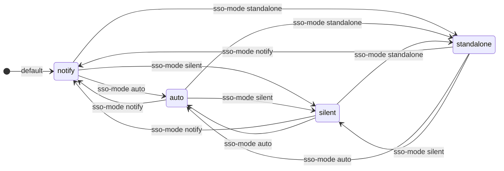
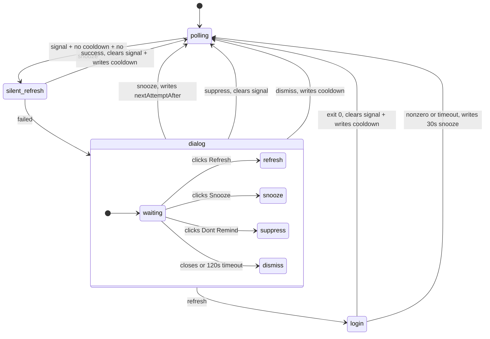
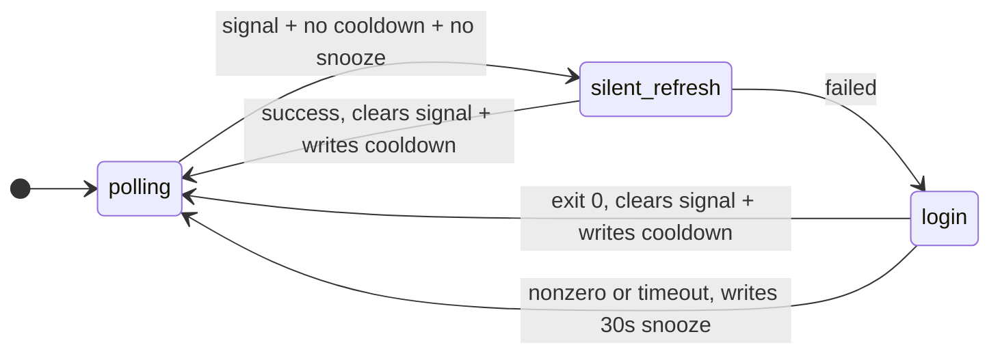
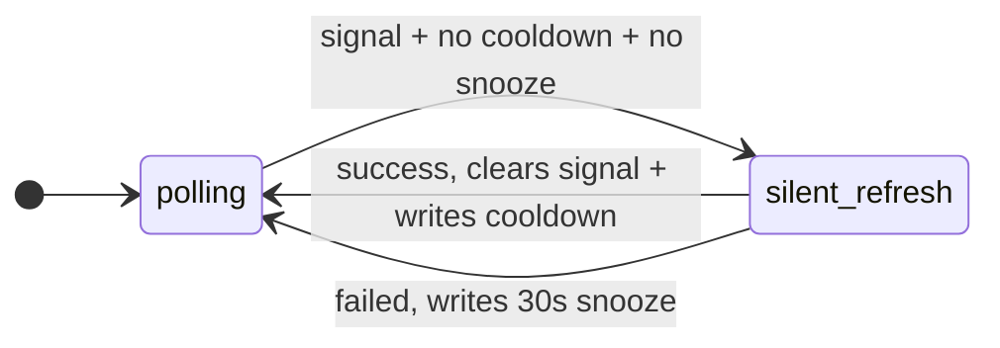
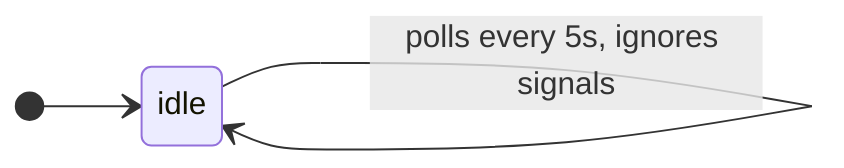
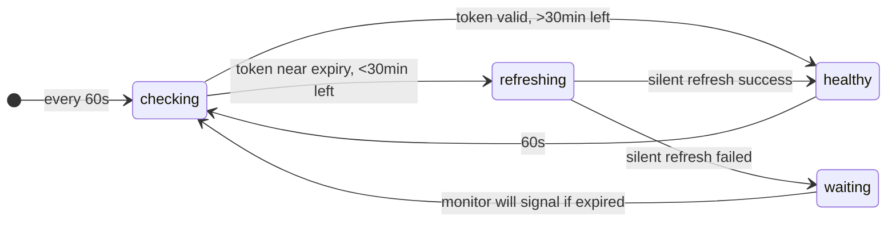
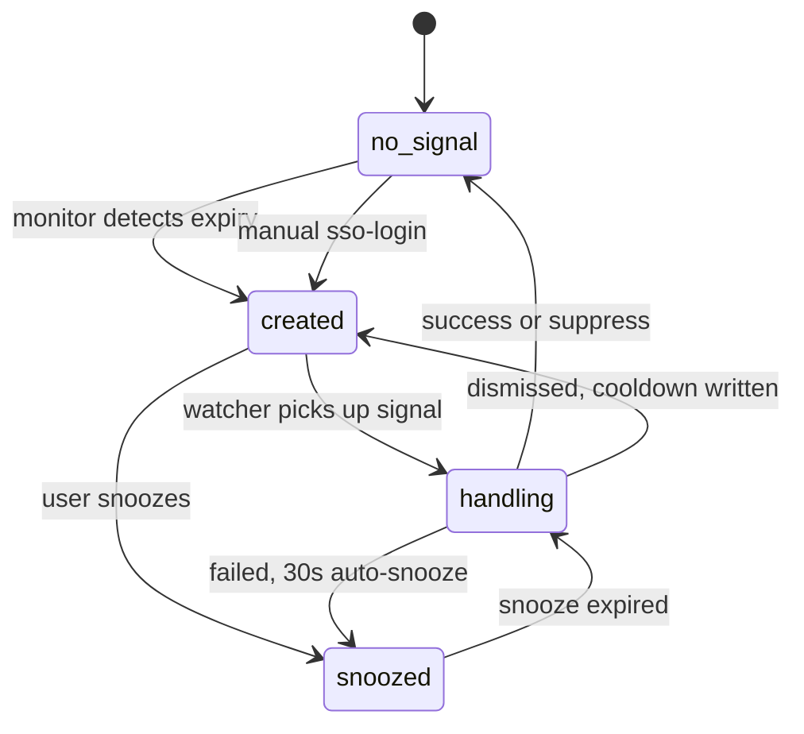
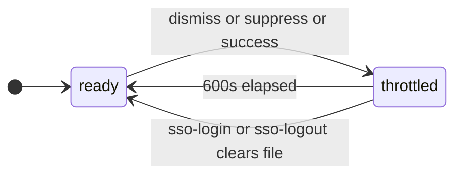
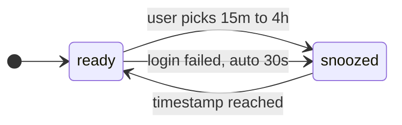

# State Machines

Formal state descriptions for the SSO watcher system. Designed for both human review and LLM/agent consumption.

## Watcher Modes

Four modes, switchable at runtime without restart via `mise run sso-mode:*`.



## Notify Mode Flow

Default mode. Tries silent refresh first, then shows macOS dialog.



## Auto Mode Flow

Tries silent refresh first, then opens browser immediately. No dialog.



## Silent Mode Flow

Tries silent token refresh only. Never opens browser.



## Standalone Mode

Watcher idles. User runs `mise run sso-login` manually.



## Proactive Refresh (independent of signal)



## Signal Lifecycle

The signal file (`~/.aws/sso-renewer/login-required.json`) drives the watcher.



## Cooldown vs Snooze

Two separate throttle mechanisms.

**Cooldown** — file-based (`last-login-at.txt`), blocks ALL signal processing:



**Snooze** — in-signal (`nextAttemptAfter`), blocks only the current signal:



## State File Summary

| File | Written by | Read by | Purpose |
|------|-----------|---------|---------|
| `login-required.json` | monitor, sso-login | watcher | Trigger: credentials expired |
| `last-login-at.txt` | watcher on dismiss/suppress/success | watcher, sso-status | Cooldown: prevent spam |
| `mode` | sso-mode:* | watcher, sso-status, sso-login, sso-logout | Runtime mode override |
| `login.lock/` | watcher via mkdir | watcher | Concurrency: single login |

All files in `~/.aws/sso-renewer/`.

## Transition Table (for agents)

Machine-readable transition table for the main watcher loop:

```
STATE                | CONDITION                          | ACTION                        | NEXT
---------------------|------------------------------------|------------------------------ |------------------
polling              | no signal file                     | sleep                         | polling
polling              | signal + cooldown active           | sleep                         | polling
polling              | signal + snooze active             | sleep                         | polling
polling              | signal + lock held                 | sleep                         | polling
polling              | signal + ready + lock acquired     | handle_login                  | handling
handling (any)       | silent refresh succeeds            | clear signal, write cooldown  | polling
handling (notify)    | silent fail > dialog > refresh > 0 | clear signal, write cooldown  | polling
handling (notify)    | silent fail > dialog > refresh > !0| write 30s snooze to signal    | polling
handling (notify)    | silent fail > dialog > snooze      | write snooze to signal        | polling
handling (notify)    | silent fail > dialog > suppress    | clear signal, write cooldown  | polling
handling (notify)    | silent fail > dialog > dismiss     | write cooldown                | polling
handling (auto)      | silent fail > login > exit 0       | clear signal, write cooldown  | polling
handling (auto)      | silent fail > login > nonzero      | write 30s snooze to signal    | polling
handling (silent)    | silent fail                        | write 30s snooze to signal    | polling
standalone           | any                                | sleep                         | standalone
```
