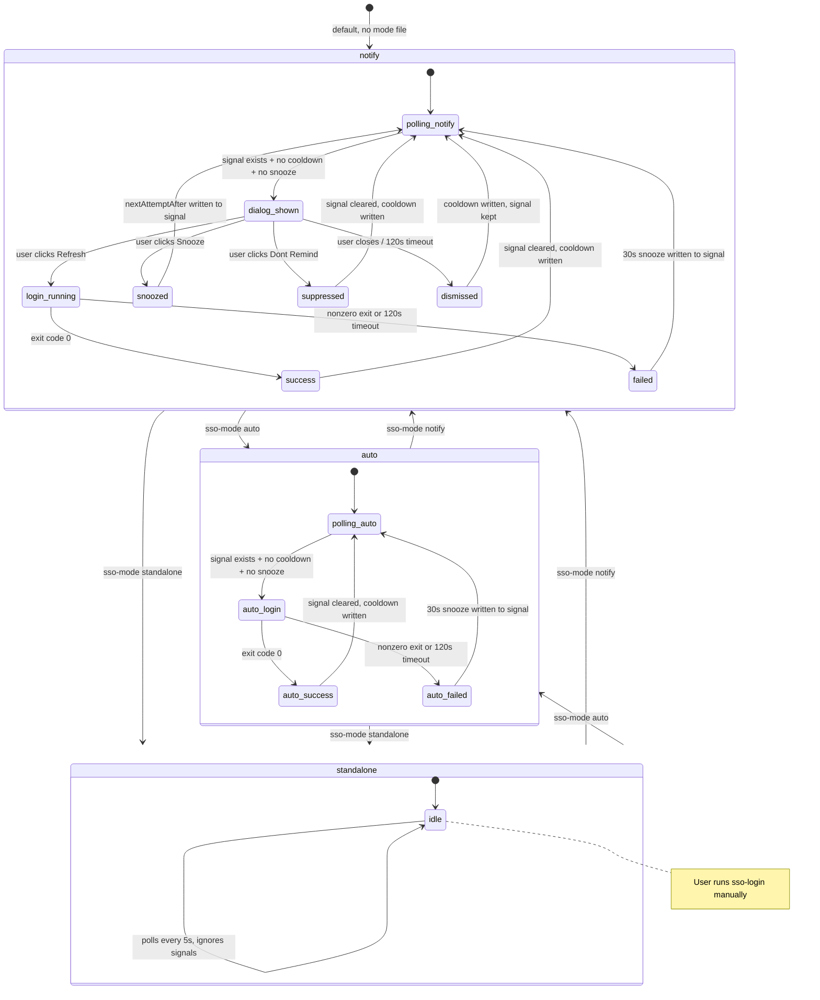
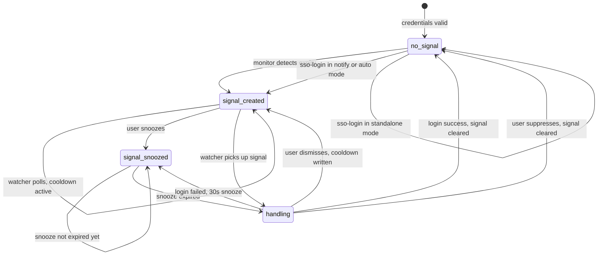
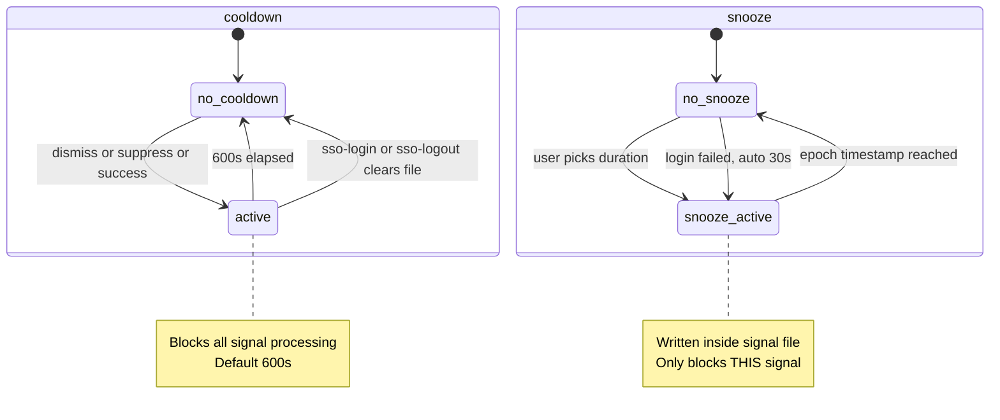

# State Machines

Formal state descriptions for the SSO watcher system. Designed for both human review and LLM/agent consumption.

## Watcher Mode State Machine

The watcher operates in one of three modes, switchable at runtime without restart.



## Signal Lifecycle

The signal file (`~/.aws/sso-renewer/login-required.json`) drives the watcher.



## Cooldown vs Snooze

Two different throttle mechanisms prevent dialog/login spam.



## State File Summary

| File | Written by | Read by | Purpose |
|------|-----------|---------|---------|
| `login-required.json` | monitor container, `mise run sso-login` | watcher | Trigger: credentials expired |
| `last-login-at.txt` | watcher (on dismiss/suppress/success) | watcher, `sso-status` | Cooldown: prevent dialog spam |
| `mode` | `mise run sso-mode:*` | watcher (every poll), `sso-status`, `sso-login`, `sso-logout` | Runtime mode override |
| `login.lock/` | watcher (mkdir) | watcher | Concurrency: single login at a time |

All files live in `~/.aws/sso-renewer/`.

## Transition Table (for agents)

Machine-readable transition table for the main watcher loop (notify/auto modes):

```
CURRENT_STATE        | CONDITION                          | ACTION                    | NEXT_STATE
---------------------|------------------------------------|---------------------------|------------------
polling              | no signal file                     | sleep(poll)               | polling
polling              | signal + cooldown active           | sleep(poll)               | polling
polling              | signal + snooze active             | sleep(poll)               | polling
polling              | signal + lock held                 | sleep(poll)               | polling
polling              | signal + ready + lock acquired     | handle_login()            | handling
handling (notify)    | dialog → refresh → exit 0          | clear signal, write cooldown | polling
handling (notify)    | dialog → refresh → exit != 0       | write 30s snooze to signal | polling
handling (notify)    | dialog → snooze                    | write snooze to signal    | polling
handling (notify)    | dialog → suppress                  | clear signal, write cooldown | polling
handling (notify)    | dialog → dismiss/timeout           | write cooldown            | polling
handling (auto)      | login → exit 0                     | clear signal, write cooldown | polling
handling (auto)      | login → exit != 0                  | write 30s snooze to signal | polling
standalone           | any                                | sleep(poll)               | standalone
```
