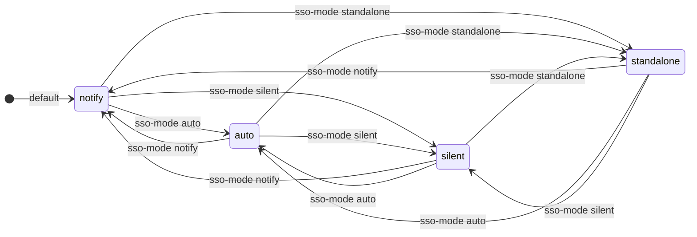
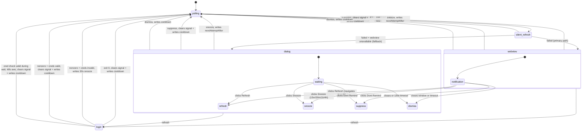
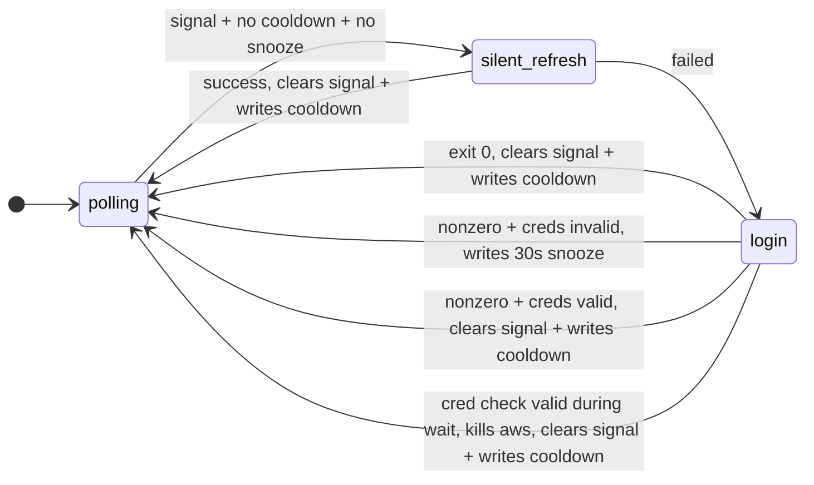
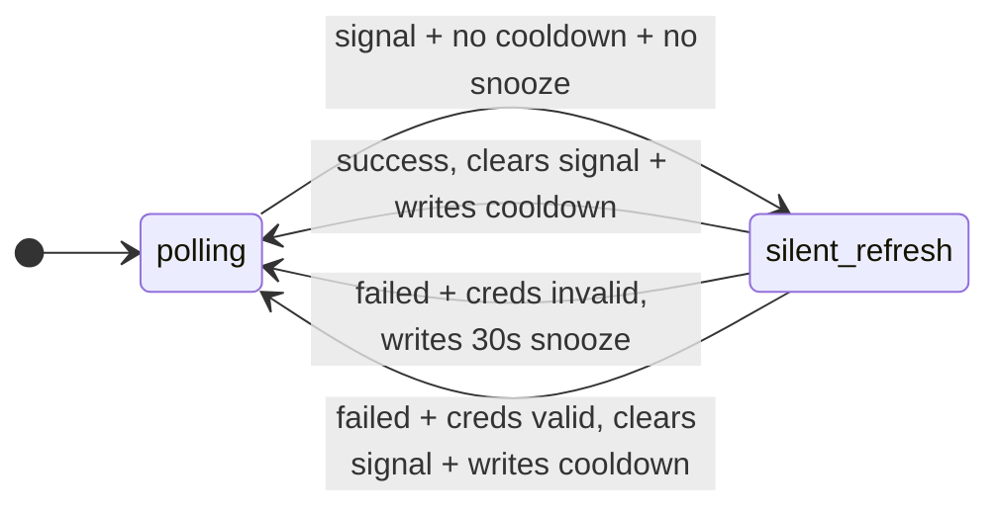
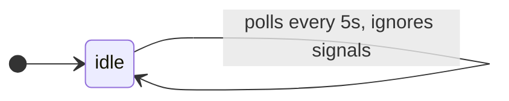
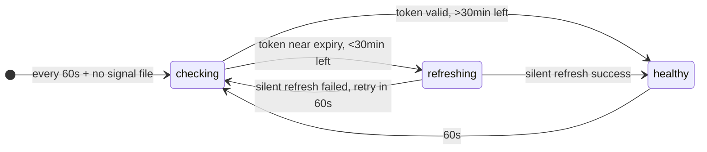
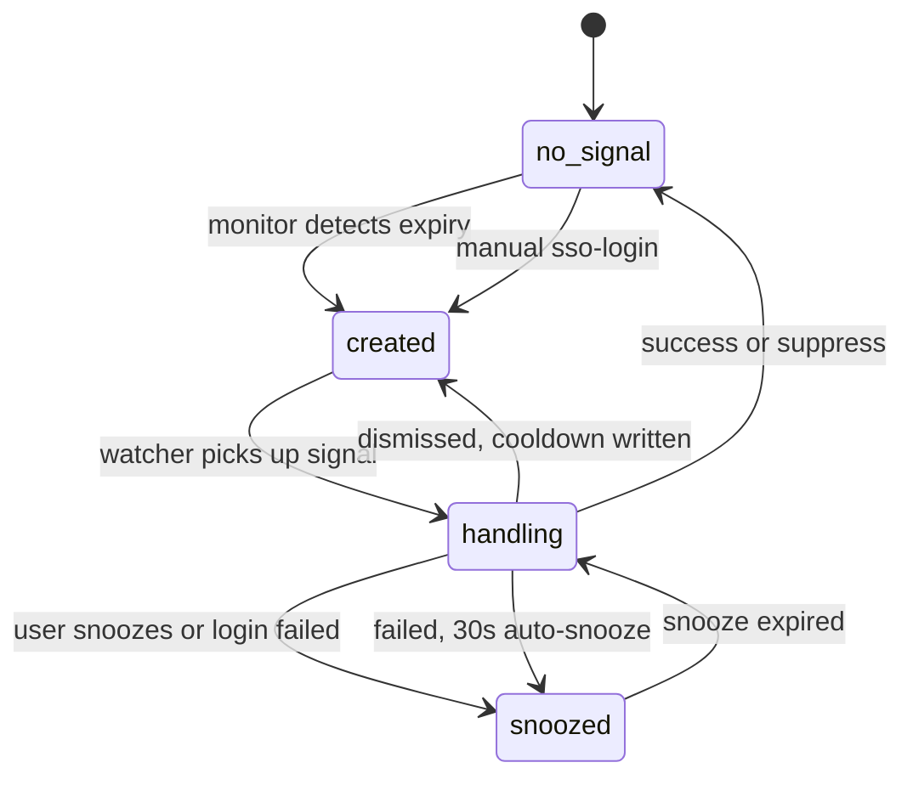
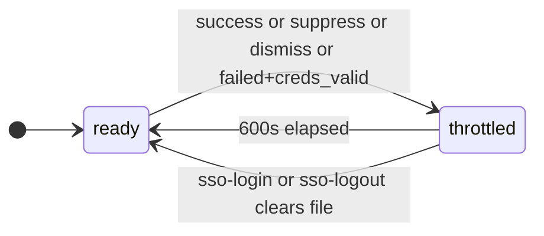
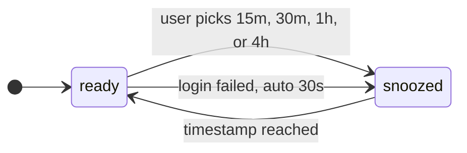

# State Machines

Formal state descriptions for the SSO watcher system. Designed for both human review and LLM/agent consumption.

## Watcher Modes

Four modes, switchable at runtime without restart via `mise run sso-mode:*`.


```mermaid
stateDiagram-v2
    direction LR
    [*] --> notify : default
    notify --> auto : sso-mode auto
    notify --> silent : sso-mode silent
    notify --> standalone : sso-mode standalone
    auto --> notify : sso-mode notify
    auto --> silent : sso-mode silent
    auto --> standalone : sso-mode standalone
    silent --> notify : sso-mode notify
    silent --> auto : sso-mode auto
    silent --> standalone : sso-mode standalone
    standalone --> notify : sso-mode notify
    standalone --> auto : sso-mode auto
    standalone --> silent : sso-mode silent
```

## Notify Mode Flow

Default mode. Tries silent refresh first, then opens all-in-one webview (notification page → auth). Falls back to osascript dialog if webview unavailable.


```mermaid
stateDiagram-v2
    direction TB
    [*] --> polling

    polling --> silent_refresh : signal + no cooldown + no snooze
    silent_refresh --> polling : success, clears signal + writes cooldown

    silent_refresh --> webview : failed (primary path)
    silent_refresh --> dialog : failed + webview unavailable (fallback)

    state webview {
        direction LR
        [*] --> notification
        notification --> refresh : clicks Refresh (navigates to auth)
        notification --> snooze : clicks Snooze (15m/30m/1h/4h)
        notification --> suppress : clicks Dont Remind
        notification --> dismiss : closes window or timeout
    }

    state dialog {
        direction LR
        [*] --> waiting
        waiting --> refresh : clicks Refresh
        waiting --> snooze : clicks Snooze
        waiting --> suppress : clicks Dont Remind
        waiting --> dismiss : closes or 120s timeout
    }

    webview --> login : refresh
    dialog --> login : refresh
    webview --> polling : snooze, writes nextAttemptAfter
    dialog --> polling : snooze, writes nextAttemptAfter
    webview --> polling : suppress, clears signal + writes cooldown
    dialog --> polling : suppress, clears signal + writes cooldown
    webview --> polling : dismiss, writes cooldown
    dialog --> polling : dismiss, writes cooldown

    login --> polling : exit 0, clears signal + writes cooldown
    login --> polling : nonzero + creds invalid, writes 30s snooze
    login --> polling : nonzero + creds valid, clears signal + writes cooldown
    login --> polling : cred check valid during wait, kills aws, clears signal + writes cooldown
```

## Auto Mode Flow

Tries silent refresh first, then opens webview immediately. No dialog.


```mermaid
stateDiagram-v2
    direction LR
    [*] --> polling
    polling --> silent_refresh : signal + no cooldown + no snooze
    silent_refresh --> polling : success, clears signal + writes cooldown
    silent_refresh --> login : failed
    login --> polling : exit 0, clears signal + writes cooldown
    login --> polling : nonzero + creds invalid, writes 30s snooze
    login --> polling : nonzero + creds valid, clears signal + writes cooldown
    login --> polling : cred check valid during wait, kills aws, clears signal + writes cooldown
```

## Silent Mode Flow

Tries silent token refresh only. Never opens webview/browser.


```mermaid
stateDiagram-v2
    direction LR
    [*] --> polling
    polling --> silent_refresh : signal + no cooldown + no snooze
    silent_refresh --> polling : success, clears signal + writes cooldown
    silent_refresh --> polling : failed + creds invalid, writes 30s snooze
    silent_refresh --> polling : failed + creds valid, clears signal + writes cooldown
```

## Standalone Mode

Watcher idles. User runs `mise run sso-login` manually.


```mermaid
stateDiagram-v2
    direction LR
    [*] --> idle
    idle --> idle : polls every 5s, ignores signals
```

## Proactive Refresh (independent of signal)

Runs inside watcher main loop every 60s. Only when no signal file exists (signal-based flow takes priority).


```mermaid
stateDiagram-v2
    direction LR
    [*] --> checking : every 60s + no signal file
    checking --> healthy : token valid, >30min left
    checking --> refreshing : token near expiry, <30min left
    refreshing --> healthy : silent refresh success
    refreshing --> checking : silent refresh failed, retry in 60s
    healthy --> checking : 60s
```

## Signal Lifecycle

The signal file (`~/.aws/sso-renewer/login-required.json`) drives the watcher.


```mermaid
stateDiagram-v2
    direction TB
    [*] --> no_signal

    no_signal --> created : monitor detects expiry
    no_signal --> created : manual sso-login

    created --> handling : watcher picks up signal

    handling --> snoozed : user snoozes or login failed
    snoozed --> handling : snooze expired

    handling --> no_signal : success or suppress
    handling --> snoozed : failed, 30s auto-snooze
    handling --> created : dismissed, cooldown written
```

## Cooldown vs Snooze

Two separate throttle mechanisms.

**Cooldown** — file-based (`last-login-at.txt`), blocks ALL signal processing:


```mermaid
stateDiagram-v2
    direction LR
    [*] --> ready
    ready --> throttled : success or suppress or dismiss or failed+creds_valid
    throttled --> ready : 600s elapsed
    throttled --> ready : sso-login or sso-logout clears file
```

**Snooze** — in-signal (`nextAttemptAfter`), blocks only the current signal:


```mermaid
stateDiagram-v2
    direction LR
    [*] --> ready
    ready --> snoozed : user picks 15m, 30m, 1h, or 4h
    ready --> snoozed : login failed, auto 30s
    snoozed --> ready : timestamp reached
```

## State File Summary

| File | Written by | Read by | Purpose |
|------|-----------|---------|---------|
| `login-required.json` | monitor, sso-login | watcher | Trigger: credentials expired |
| `last-login-at.txt` | watcher on success/suppress/dismiss/failed+creds valid | watcher, sso-status | Cooldown: prevent spam |
| `mode` | sso-mode:* | watcher, sso-status, sso-login, sso-logout | Runtime mode override |
| `login.lock/` | watcher via mkdir | watcher | Concurrency: single login |

All files in `~/.aws/sso-renewer/`.

## Transition Table (for agents)

Machine-readable transition table for the main watcher loop:

```
STATE                | CONDITION                          | ACTION                        | NEXT
---------------------|------------------------------------|------------------------------ |------------------
polling              | no signal file                     | sleep                         | polling
polling              | signal + cooldown active           | sleep                         | polling
polling              | signal + snooze active             | sleep                         | polling
polling              | signal + lock held                 | sleep                         | polling
polling              | signal + ready + lock acquired     | handle_login                  | handling
handling (any)       | silent refresh succeeds            | clear signal, write cooldown  | polling
handling (notify)    | silent fail > webview > refresh > 0  | clear signal, write cooldown  | polling
handling (notify)    | silent fail > webview > refresh > !0 + creds invalid | write 30s snooze | polling
handling (notify)    | silent fail > webview > refresh > !0 + creds valid   | clear signal, write cooldown | polling
handling (notify)    | silent fail > webview > snooze      | write snooze to signal        | polling
handling (notify)    | silent fail > webview > suppress    | clear signal, write cooldown  | polling
handling (notify)    | silent fail > webview > dismiss     | write cooldown                | polling
handling (notify)    | silent fail > login > cred valid    | clear signal, write cooldown  | polling
handling (auto)      | silent fail > login > exit 0        | clear signal, write cooldown  | polling
handling (auto)      | silent fail > login > !0 + creds invalid | write 30s snooze        | polling
handling (auto)      | silent fail > login > !0 + creds valid   | clear signal, write cooldown | polling
handling (auto)      | silent fail > login > cred valid    | clear signal, write cooldown  | polling
handling (silent)    | silent fail + creds invalid         | write 30s snooze to signal    | polling
handling (silent)    | silent fail + creds valid           | clear signal, write cooldown  | polling
standalone           | any                                | sleep                         | standalone
```

## Setup Flow (`mise run setup`)

Interactive first-time setup. Each phase is a function in `scripts/setup.py`.


```mermaid
flowchart TB
    start([mise run setup]) --> prereqs

    subgraph prereqs["Phase 1: Prerequisites"]
        direction TB
        p1[Check mise] --> p2[Check aws CLI ≥ 2.9]
        p2 --> p3[Check podman/docker]
        p3 --> p4[Check swiftc — optional, prompts install]
    end

    prereqs -->|errors > 0| fail_exit([Exit 1])
    prereqs -->|all ok| env

    subgraph env["Phase 2: Configure .env"]
        direction TB
        e1{.env exists?}
        e1 -->|yes| e2{Overwrite?}
        e2 -->|no| e3[Parse existing .env]
        e2 -->|yes| e4[Prompt: profile, region, bucket, port, mode]
        e1 -->|no| e4
        e4 --> e5[Write .env]
    end

    env --> tools["Phase 3: mise install (Python)"]
    tools --> watcher["Phase 4: sso-install (webview + launchd)"]
    watcher --> perms

    subgraph perms["Phase 5: macOS Permissions"]
        direction TB
        g1{GUI session?}
        g1 -->|no| g2[Skip — headless]
        g1 -->|yes| g3[Test System Events]
        g3 -->|ok| g4[Test dialog display]
        g3 -->|denied/timeout| perms_fail([Exit 1])
        g4 -->|denied/timeout| perms_fail
    end

    perms -->|ok or headless| sso

    subgraph sso["Phase 6: AWS SSO Config"]
        direction TB
        s1{SSO configured?}
        s1 -->|modern/legacy| s2[OK]
        s1 -->|no| s3{Configure now?}
        s3 -->|yes| s4[aws configure sso]
        s3 -->|no/skip| s5[Skip]
    end

    sso --> login

    subgraph login["Phase 7: Login + Validate"]
        direction TB
        l1{SSO configured?}
        l1 -->|no| l2[Skip]
        l1 -->|yes| l3{Credentials valid?}
        l3 -->|yes| l4[OK]
        l3 -->|no| l5[Pause watcher → standalone]
        l5 --> l6[SSO login via webview]
        l6 --> l7[Restore watcher mode]
        l7 --> l8{S3 bucket set?}
        l4 --> l8
        l8 -->|yes| l9[Validate S3 access]
        l8 -->|no/placeholder| l10[Skip]
    end

    login --> containers

    subgraph containers["Phase 8: Start Containers"]
        direction TB
        c1{Start now?}
        c1 -->|yes| c2[mise run containers:up]
        c1 -->|no| c3[Skip]
    end

    containers --> summary([Setup complete!])
```

### Setup Error Handling

Most phases after prerequisites use **warn-and-continue** — failures produce warnings but don't abort. Phases 1 (prerequisites) and 5 (permissions) are hard gates.

| Phase | On failure | Behavior |
|-------|-----------|----------|
| 1. Prerequisites | Missing mise/aws/container | **Exit 1** — cannot proceed |
| 2. .env | — | Always succeeds |
| 3. mise install | Command fails | Warn, continue |
| 4. sso-install | Build/load fails | Warn, continue |
| 5. Permissions | Denied / timeout (60s) | **Exit 1** — watcher can't function |
| 6. SSO config | aws configure sso fails | Warn, continue |
| 7. Login | Login fails / S3 inaccessible | Warn, continue |
| 8. Containers | compose up fails | Warn, continue |
